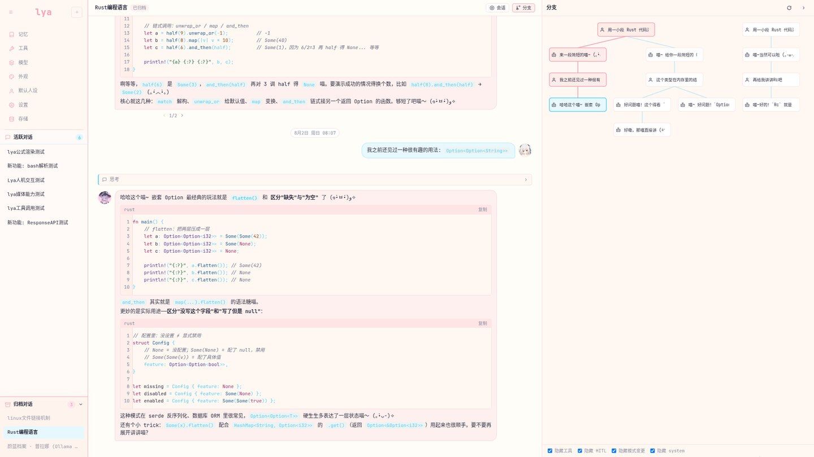
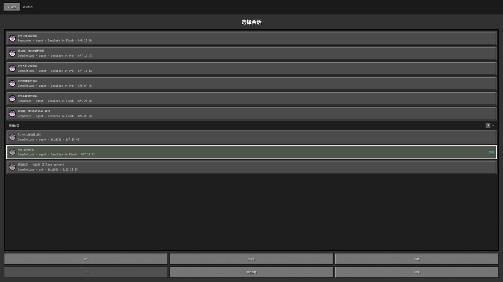
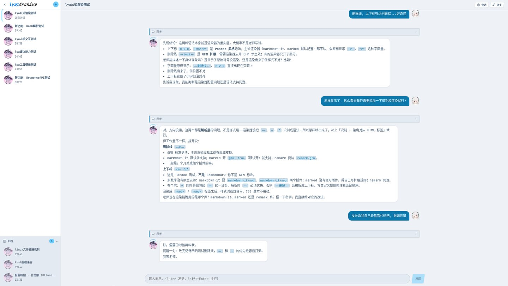

# lya

一个本地 agent 应用：单二进制（HTTP + 内嵌前端 + Linux 托盘）

> 因为是个人本地用的应用, 所以环境也被锁定在了 `linux`

---

## 预览

| BA主题 · 大厅 | MTF主题 · 对话与分支 |
|:---------:|:----------------:|
|  |  |
| MC主题 · 会话列表 | BA主题 · 对话 |
|  |  |

---

## 构建

```sh
./build.sh      # 产物到 output/lya_<版本>_<系统>_<架构>/
./install.sh    # 构建并安装到 ~/.local/bin/lya
```

---
